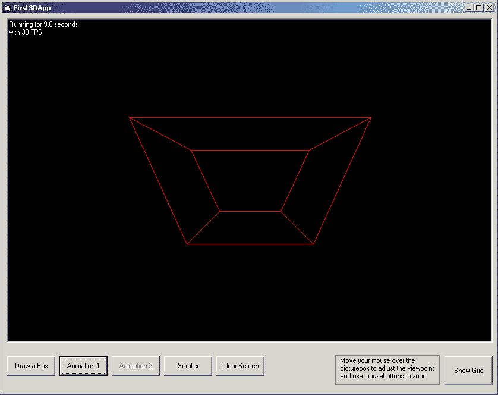



## \[\_a Simple 3D Engine, PURE VB\]

### Description

This code enables you to draw 3D lines easiely into a picture box and creat 3D Objects this way which can be animated. Features: Changing viewpoint, Zooming, Examples included ...
 
### More Info
 
Even if you don't understand a lot of math you will be able to use the engine.

fun :)

             |
---                |---
**Submitted On**   |2002-06-20 22:54:18
**By**             |[over](https://github.com/Planet-Source-Code/PSCIndex/blob/master/ByAuthor/over.md)
**Level**          |Advanced
**User Rating**    |5.0 (65 globes from 13 users)
**Compatibility**  |VB 6\.0
**Category**       |[Graphics](https://github.com/Planet-Source-Code/PSCIndex/blob/master/ByCategory/graphics__1-46.md)
**World**          |[Visual Basic](https://github.com/Planet-Source-Code/PSCIndex/blob/master/ByWorld/visual-basic.md)
**Archive File**   |[Simple\_3D\_970496202002\.zip](https://github.com/Planet-Source-Code/over-a-simple-3d-engine-pure-vb__1-36091/archive/master.zip)

